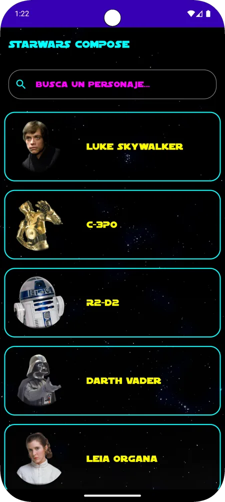
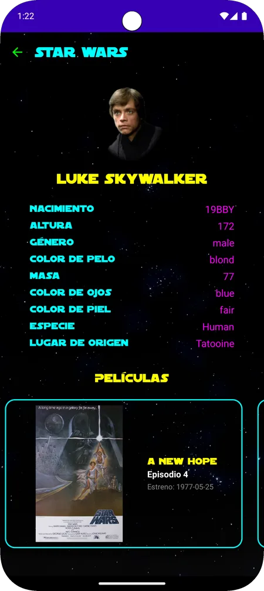
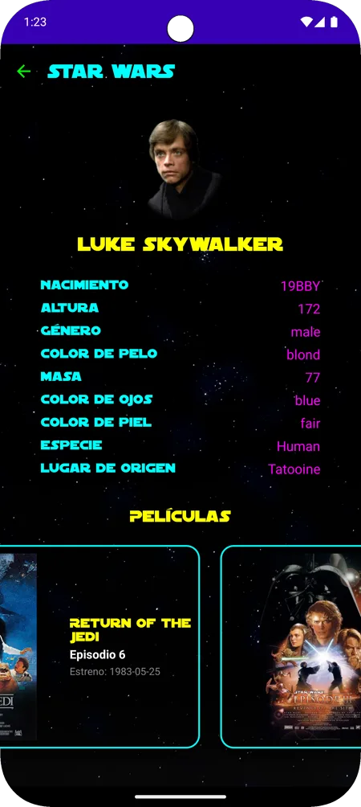

# StarWars Compose 🌌


Aplicación Android desarrollada para practicar el consumo de **APIs REST** con **Jetpack Compose**. Conecta con la API pública **SWAPI** para mostrar personajes del universo Star Wars, con su detalle completo (datos biográficos, especie, planeta de origen) y las películas en las que aparecen.

---

## Capturas de pantalla

| Lista de personajes | Detalle de personaje | Películas del personaje |
|--------|---------|---------------------|
|  |  |  |

---

## Funcionalidades

- **Listado de personajes**: carga desde SWAPI con foto, nombre y buscador en tiempo real.
- **Detalle de personaje**: nacimiento, altura, género, color de pelo, masa, ojos, piel, especie y planeta.
- **Películas del personaje**: carátula, título, episodio y fecha de estreno en carrusel horizontal.
- **Carga paralela**: planetas, especies y películas se resuelven simultáneamente con `async` / `awaitAll`.
- **Buscador**: filtrado por nombre sin llamadas extra a la API.
- **Navegación**: paso de argumentos entre pantallas con NavHost.

---

## Arquitectura

```
ui/
├── main/             ← MainActivity
├── screens/          ← CharacterScreen, CharacterDetailScreen
└── theme/            ← Tema de Compose

viewmodel/            ← StarWarsViewModel

data/
├── models/           ← StarWarsCharacter (modelo de dominio)
└── remote/
    ├── responses/    ← DTOs de la API (CharactersResponse, FilmResponse, PlanetResponse, SpeciesResponse)
    └── StarWarsApi   ← Interfaz Retrofit (SWAPI)

di/                   ← AppModule (módulo Hilt)
utils/                ← Extensions.kt
StarWarsApp           ← Clase Application (Hilt)
```

**Flujo de datos:**

```
UI (Compose)
    ↕ collectAsStateWithLifecycle
StarWarsViewModel (StateFlow)
    ↕ suspend functions
StarWarsApi (Retrofit)
    └── SWAPI (API REST pública)
```

---

## Tecnologías

| Área | Tecnología |
|------|-----------|
| UI | Jetpack Compose |
| Lenguaje | Kotlin |
| Arquitectura | MVVM |
| Red | Retrofit + kotlinx.serialization |
| Imágenes | Coil |
| Inyección de dependencias | Hilt |
| Async | Coroutines + StateFlow |
| Navegación | Navigation Compose |

---

## Primeros pasos

> [!NOTE]
> No necesita claves ni configuración: **SWAPI es una API pública**. Solo clonar y ejecutar.

1. Clona el repositorio:
   ```bash
   git clone https://github.com/rafamartinez99/StarWarsCompose.git
   ```
2. Abre el proyecto en **Android Studio Hedgehog** o superior.
3. Sincroniza Gradle y ejecuta en un emulador o dispositivo Android.

---

## Decisiones técnicas

- **Carga paralela con `async` / `awaitAll`**: planetas, especies y películas se resuelven en paralelo en lugar de secuencialmente, reduciendo el tiempo de carga total.
- **ViewModel compartido**: un único `StarWarsViewModel` inyectado con Hilt gestiona el estado de ambas pantallas, evitando recargas innecesarias al navegar.
- **Separación respuestas / modelo**: las respuestas de la API se deserializan en DTOs (`...Response`) con `@SerialName` para los campos `snake_case`, y se combinan en un modelo de dominio limpio (`StarWarsCharacter`) que consume la UI.

---

## Licencia

Este proyecto se distribuye bajo la licencia MIT. Consulta el fichero [LICENSE](LICENSE) para más información.
